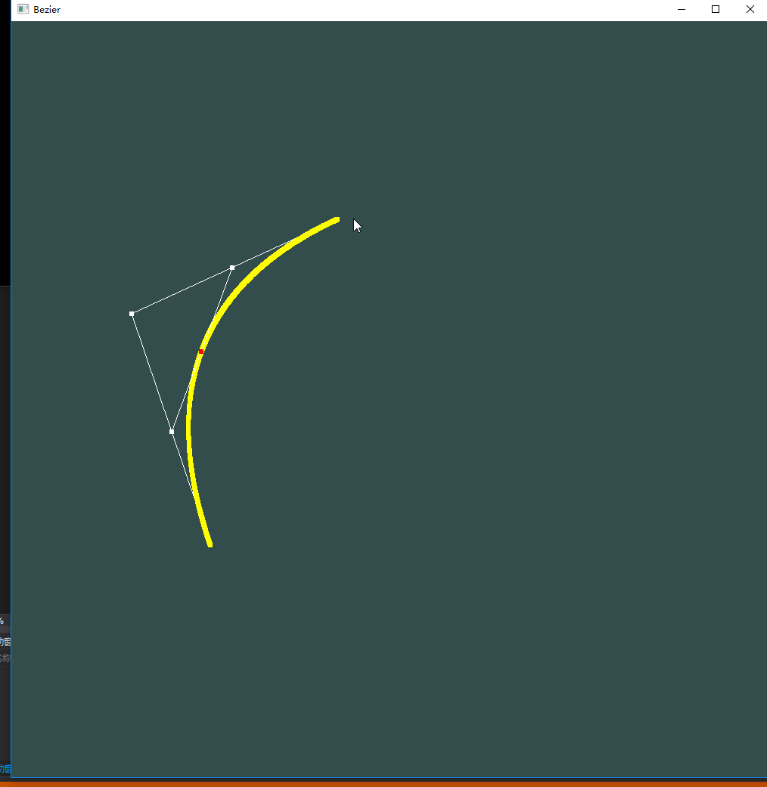
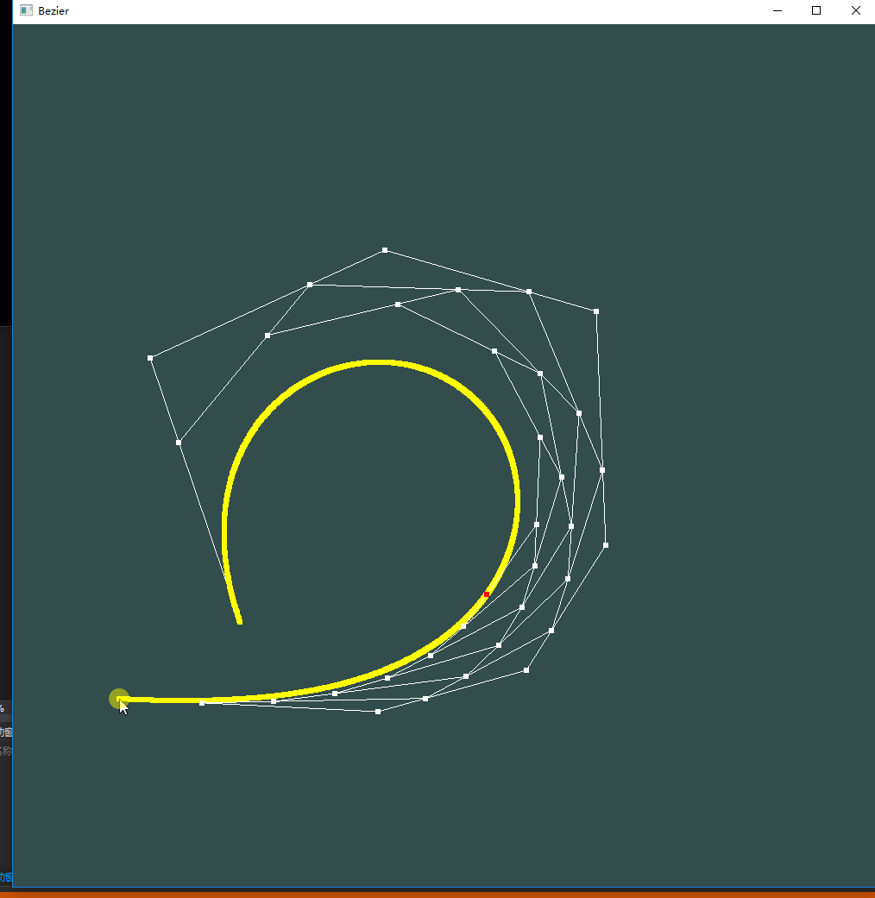
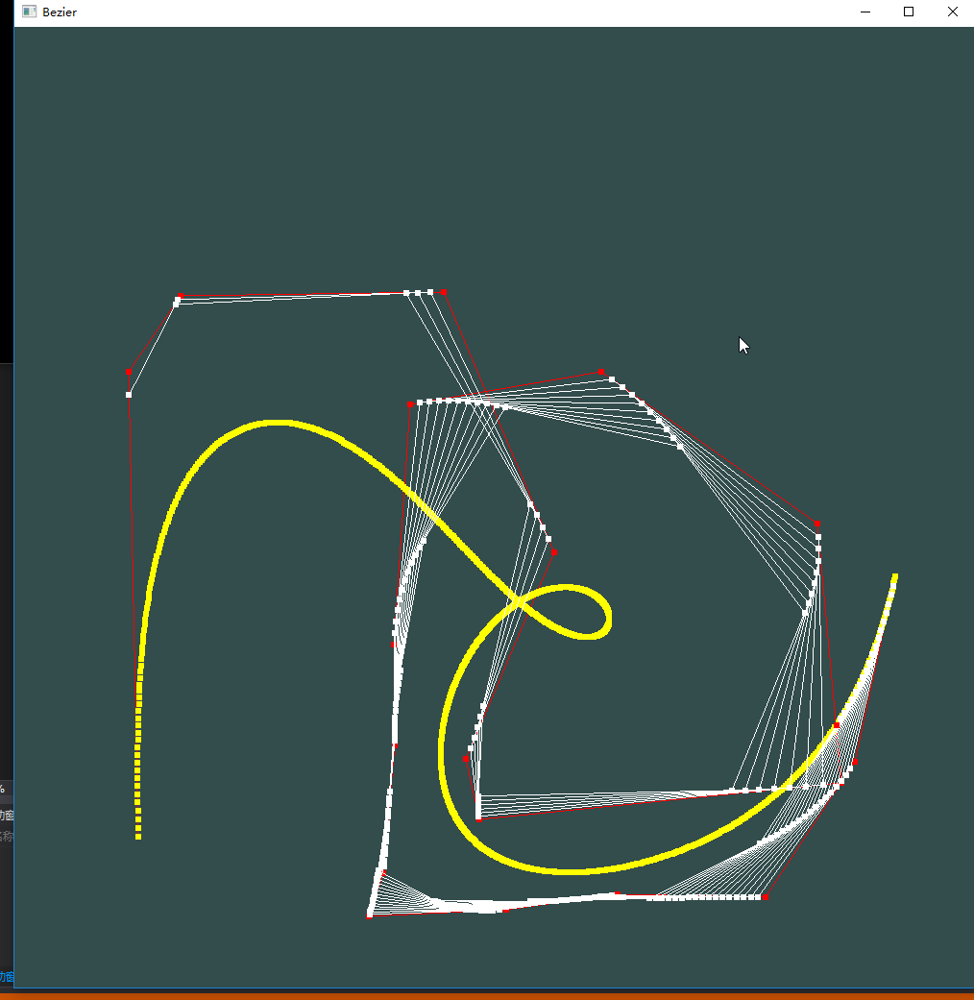
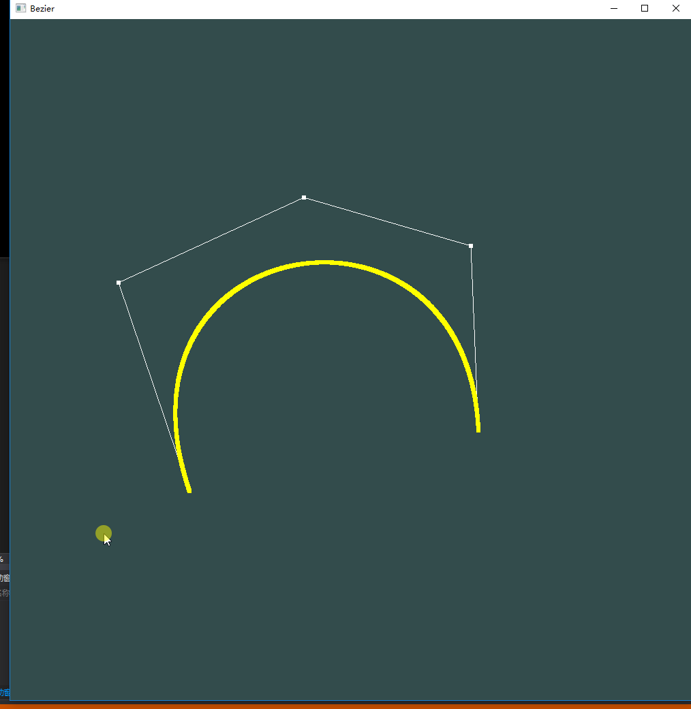

# Homework8

### 要求：

- 用户能通过左键点击添加Bezier曲线的控制点，右键点击则对当前添加的最后一个控制点进行消除

- 工具根据鼠标绘制的控制点实时更新Bezier曲线
- 可以动态地呈现Bezier曲线的生成过程

### Bezier曲线

Bezier曲线可以用数学公式表示：
$$
Q(t) = \sum_{i = 0}^{n}P_iB_{i, n}(t)
$$
其中，Pi为第i个点的坐标，而Bi,n为伯恩斯坦函数，且符合：
$$
t\in[0, 1]
$$
对于伯恩斯坦函数：
$$
B_{i, n}(t) = \frac{n!}{i!(n-i)!}t^i(1-t)^{n-i}, i=0,1,2,...,n
$$
对于其中的阶乘，我们需要如下处理：

#### 避免溢出

即使我们可以使用`long long int`存储大数，但依旧只能计算到20的阶乘。所以我们最多也就只能画出20个点，当超过20个点的时候，我们将图上所有点设置为红色，提醒超出范围。

#### 左键和右键处理

如果点击左键，则对当前点的数量进行判断，如果小于20个点，则将鼠标当前位置压栈；如果大于20个点，则将图上的所有点击的点设置为红色。

如果点击的是右键，则进行数量的判断，如果大于0则将栈顶弹出。

```c++
// 左键
        if (Mouse::getInstance()->isPress && Mouse::getInstance()->left) {
            if (press_points.size() < POINT_MAX) {
                press_points.push(glm::vec2(Mouse::getInstance()->pos_x, Mouse::getInstance()->pos_y));
                press_points_vec.clear();
                isRed = false;
            }
            else {
                isRed = true;
            }
            Mouse::getInstance()->isPress = false;
        }
        // 右键
        if (Mouse::getInstance()->isPress && !Mouse::getInstance()->left) {
            if(press_points.size() > 0)press_points.pop();
            press_points_vec.clear();
            deltaTime = glfwGetTime();
            isRed = false;
            Mouse::getInstance()->isPress = false;
        }
        shader.use();
        // 获得所有的点
        stack<glm::vec2> tmp = press_points;
        int count = 0;
        bool fill = press_points_vec.empty();
        while (tmp.size() != 0) {
            glm::vec2 point = tmp.top();
            if (fill) press_points_vec.insert(press_points_vec.begin(), point);
            tmp.pop();
            if (isRed) {
                count = buff_set(count, point, red);
            }
            else {
                count = buff_set(count, point, white);
            }
        }
```

##### 鼠标动作回调函数

这里需要在`Initial.h`头文件中添加回调函数，如果鼠标点击则进行左键右键的判断，如果移动则进行位置的保存。

```c++
    static void mouseMove_callback(GLFWwindow* window, double pos_x, double pos_y) {
        Mouse::getInstance()->pos_x = pos_x;
        Mouse::getInstance()->pos_y = pos_y;
    }

    static void mouseClick_callback(GLFWwindow* window, int button, int action, int mods) {
        Mouse::getInstance()->isPress = action == GLFW_PRESS;
        Mouse::getInstance()->left = (button == GLFW_MOUSE_BUTTON_LEFT);
    }
```

```c++
glfwSetMouseButtonCallback(window, mouseClick_callback);
glfwSetCursorPosCallback(window, mouseMove_callback);
```

### 画出曲线

按照Bezier曲线的公式，我们可以画出曲线上的点。我们可以选择t的步长为0.005/0.002/0.001，步长越小越占空间，而步长越大如果两点之间距离过大则线出现失真的问题。为了减少计算量，在循环之前计算好阶乘结果，直接可以调用。

```c++
 // 计算阶乘
    for (int i = 0; i < POINT_MAX; ++i) {
        if (i == 0) multiple_result[i] = 1;
        else if (i == 1) multiple_result[i] = 1;
        else if (i == 2) multiple_result[i] = 2;
        else multiple_result[i] = multiple_result[i - 1] * i;
    }
```

计算Bezier函数：

```c++
float Bezier(int i, int n, float t) {
    if (n >= POINT_MAX || i >= POINT_MAX || n - i >= POINT_MAX) {
        overflow = true;
        return 0.0f;
    }
    long long int n_result = multiple_result[n];
    long long int i_result = multiple_result[i];
    long long int ni_result = multiple_result[n - i];

    float alpha = n_result / i_result / ni_result;
    return (alpha * pow(t, i) * pow(1 - t, n - i));
}
```

### 辅助线

为了使得效果更好，在每次添加或者减少点的时候增加了两秒钟的延时。通过插值可以获得某个时刻每两个点之间的直线上点的位置。通过多次插值式计算，可以获得所有辅助线上的点。最后，将曲线上的点标出红色。
```c++
if (currentTime - deltaTime > 2.0f) {
                //--------------- 画出辅助线--------------------------------
                vector<glm::vec2> helping_points1 = press_points_vec, helping_points2;
                count = 0;
                helping_t = helping_t > 1.0f ? 0.0f : helping_t + 0.01f;
                while (helping_points1.size() != 0) {
                    for (unsigned int i = 0; i < helping_points1.size() - 1; ++i) {
                        glm::vec2 cur = (1.0f - helping_t) * helping_points1[i] + helping_t * helping_points1[1 + i];
                        count = buff_set(count, cur, white);
                        helping_points2.push_back(cur);
                    }
                    draw(count, true);
                    count = 0;
                    helping_points1.clear();
                    helping_points1 = helping_points2;
                    helping_points2.clear();
                }
                glm::vec2 cur = glm::vec2(0.0f, 0.0f);
                for (unsigned int i = 0; i < press_points_vec.size(); i++) {
                    cur += press_points_vec[i] * Bezier(i, press_points_vec.size() - 1, helping_t);
                }
                count = buff_set(count, cur, red);
                draw(1);
                count = 0;
            }
```

## 实验结果



画出简单曲线。



如果超过限制，画出红色的点。



回撤。



动图：

